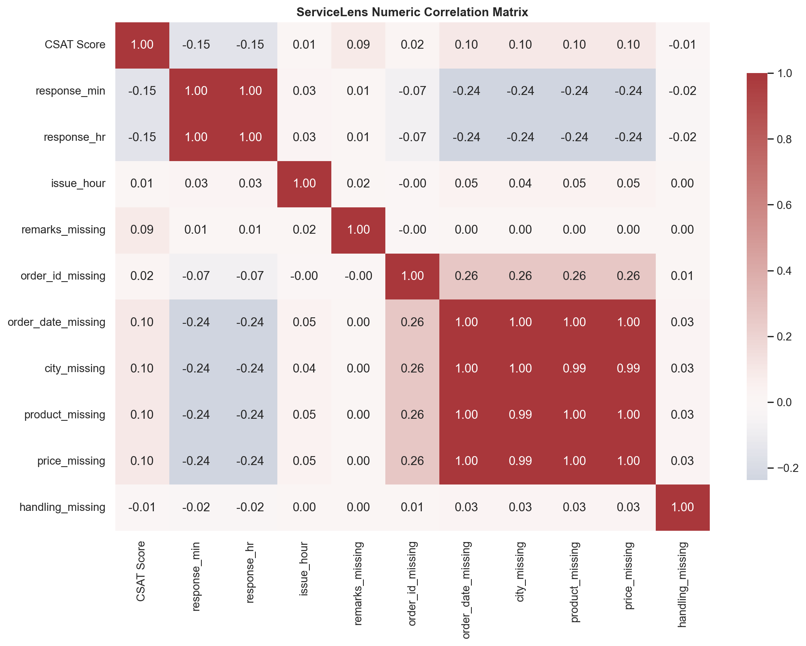

# Phase 11 - Correlation Analysis

## Numeric Correlations with CSAT

| Variable | Pearson Correlation with CSAT |
|---|---:|
| Valid response minutes | -0.1493 |
| Response time hours | -0.1493 |
| Issue hour | 0.0092 |
| Remarks missing flag | 0.0875 |
| Order ID missing flag | 0.0234 |
| Order date missing flag | 0.1000 |
| City missing flag | 0.0997 |
| Product category missing flag | 0.0998 |
| Item price missing flag | 0.0999 |
| Handling time missing flag | -0.0099 |

The Spearman correlation between CSAT and valid response minutes is -0.1854, supporting a weak negative monotonic relationship.

## Redundancy

- Response minutes and response hours correlate perfectly because they contain the same information in different units. A model should not include both.
- Order date, city, product category, and item price missingness flags correlate at approximately 0.99-1.00 with one another. These flags represent a shared missingness pattern and should not all be treated as independent evidence.

## Interpretation

Numeric correlations are weak. Correlation does not establish causality, and categorical variables such as channel, category, tenure, and shift require group-based association measures rather than Pearson correlation.

