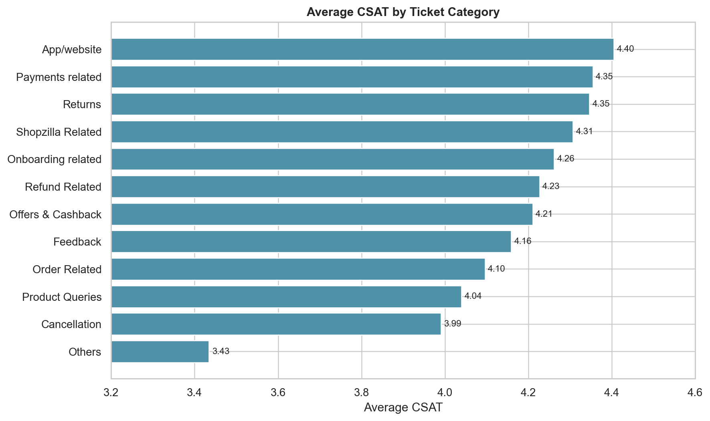

# Phase 11 - CSAT vs Category

## Results

| Category | Records | Average CSAT | Low CSAT (1-2) |
|---|---:|---:|---:|
| Returns | 44,097 | 4.3464 | 12.18% |
| Order Related | 23,215 | 4.0961 | 17.89% |
| Refund Related | 4,550 | 4.2268 | 15.01% |
| Product Queries | 3,692 | 4.0398 | 18.26% |
| Shopzilla Related | 2,792 | 4.3070 | 13.32% |
| Payments related | 2,327 | 4.3545 | 11.73% |
| Feedback | 2,294 | 4.1587 | 16.83% |
| Cancellation | 2,212 | 3.9905 | 21.47% |
| Offers & Cashback | 480 | 4.2104 | 14.79% |
| Others | 99 | 3.4343 | 33.33% |
| App/website | 84 | 4.4048 | Not emphasized |
| Onboarding related | 65 | 4.2615 | Not emphasized |

Cancellation is the weakest established category when requiring at least 100 records. The `Others` result is lower but has only 99 records and may be unstable.

At the sub-category level, notable low-performing groups with at least 100 records include Technician Visit (3.4894), Seller Cancelled Order (3.5845), Account updation (3.8200), Installation/demo (3.8831), and Not Needed (3.9219).

