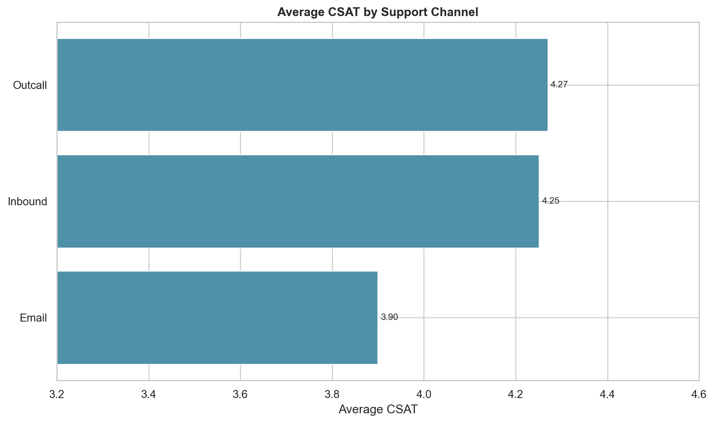

# Phase 11 - CSAT vs Channel

## Results

| Channel | Records | Average CSAT | Low CSAT (1-2) | High CSAT (4-5) |
|---|---:|---:|---:|---:|
| Inbound tickets | 68,142 | 4.2514 | 14.32% | 82.70% |
| Outcall | 14,742 | 4.2699 | 13.95% | 83.18% |
| Email | 3,023 | 3.8991 | 23.16% | 73.47% |

Email is the weakest channel in the observed data. Its average CSAT is 0.3523 points below Inbound tickets, and its low-CSAT rate is approximately nine percentage points higher.

Because Email represents only 3.52% of records, the difference should be investigated alongside issue mix and response delays before an operational cause is assigned.

