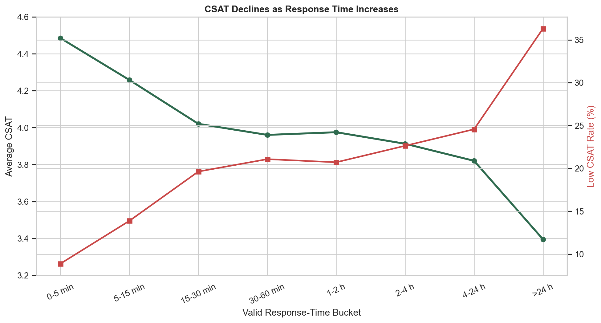

# Phase 11 - CSAT vs Response Time

## Method

Response duration was calculated from issue report and response timestamps. Only non-negative durations were used. This produced 82,779 valid records; 3,128 negative durations were excluded from this comparison without modifying source data.

## Results

| Response-Time Band | Records | Median Minutes | Average CSAT | Low CSAT (1-2) |
|---|---:|---:|---:|---:|
| 0-5 min | 40,486 | 2 | 4.4844 | 8.88% |
| 5-15 min | 13,886 | 9 | 4.2578 | 13.88% |
| 15-30 min | 5,864 | 21 | 4.0205 | 19.63% |
| 30-60 min | 4,484 | 42 | 3.9605 | 21.07% |
| 1-2 hours | 3,887 | 85 | 3.9750 | 20.71% |
| 2-4 hours | 3,512 | 168 | 3.9126 | 22.64% |
| 4-24 hours | 7,783 | 625 | 3.8202 | 24.57% |
| >24 hours | 2,877 | 2,426 | 3.3952 | 36.32% |

CSAT declines consistently as delays become longer, particularly after 15 minutes. Pearson correlation between CSAT and valid response minutes is -0.1493; Spearman correlation is -0.1854. These are descriptive associations, not proof that delay alone causes lower satisfaction.

