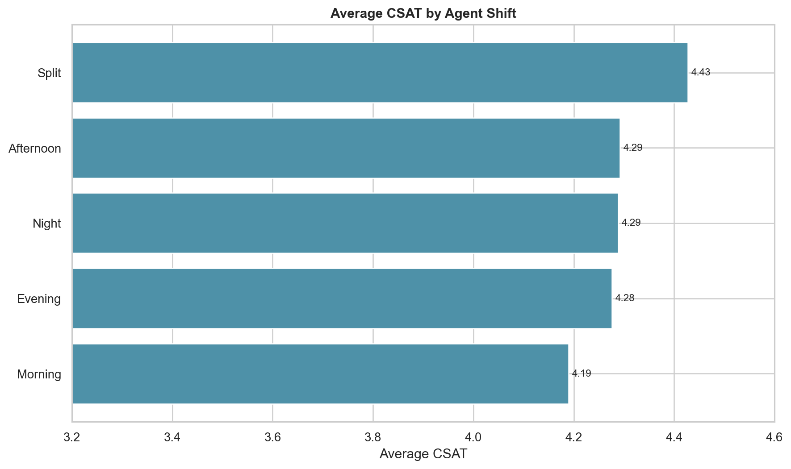

# Phase 11 - CSAT vs Shift

## Results

| Shift | Records | Average CSAT | Low CSAT (1-2) |
|---|---:|---:|---:|
| Morning | 41,426 | 4.1895 | 15.75% |
| Evening | 33,677 | 4.2764 | 13.73% |
| Afternoon | 5,840 | 4.2923 | 13.66% |
| Split | 3,648 | 4.4274 | 10.33% |
| Night | 1,316 | 4.2888 | 14.44% |

Morning has the lowest average CSAT and accounts for nearly half of all records. Split has the highest average but represents only 4.25% of records. The overall association is small (eta-squared 0.00182), and shift differences may reflect channel, issue, or staffing composition.

