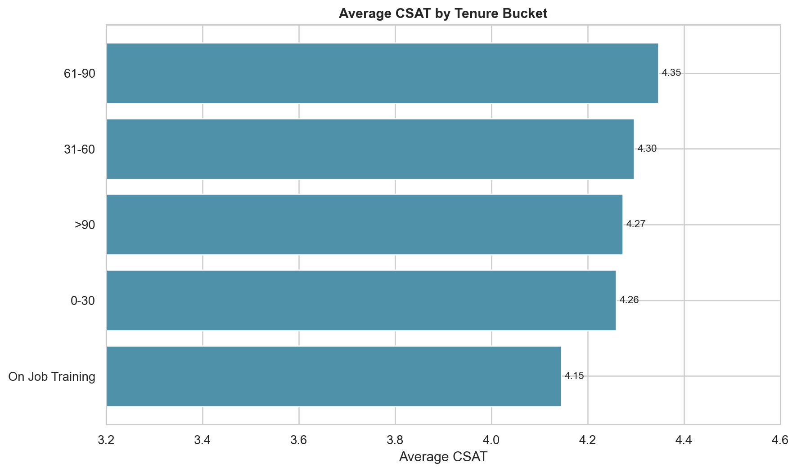

# Phase 11 - CSAT vs Agent Tenure

## Results

| Tenure | Records | Average CSAT | Low CSAT (1-2) | High CSAT (4-5) |
|---|---:|---:|---:|---:|
| 0-30 | 11,318 | 4.2588 | 14.07% | Not emphasized |
| 31-60 | 11,665 | 4.2962 | 13.37% | Not emphasized |
| 61-90 | 6,741 | 4.3465 | 12.16% | Not emphasized |
| >90 | 30,660 | 4.2732 | 14.00% | 83.28% |
| On Job Training | 25,523 | 4.1452 | 16.64% | 80.02% |

On Job Training has the lowest average CSAT and highest low-CSAT rate among tenure groups. The overall association is small (eta-squared 0.00233), so tenure alone explains little of the observed CSAT variation.

