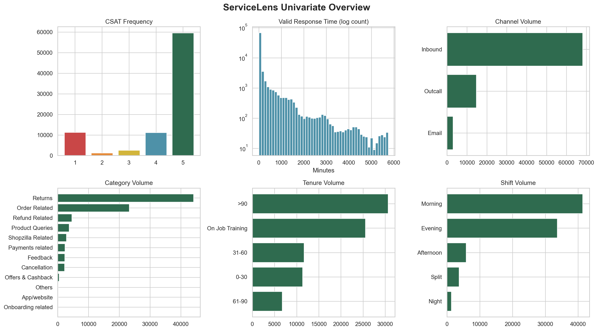

# Phase 11 - Univariate Analysis

## Scope

This report summarizes individual distributions in the processed ServiceLens dataset. It does not infer causality or modify source data.

## Dataset

- Rows: 85,907
- CSAT mean: 4.2422
- CSAT median: 5
- CSAT mode: 5

## CSAT Distribution

| CSAT Score | Count | Percent |
|---:|---:|---:|
| 1 | 11,230 | 13.07% |
| 2 | 1,283 | 1.49% |
| 3 | 2,558 | 2.98% |
| 4 | 11,219 | 13.06% |
| 5 | 59,617 | 69.40% |

High CSAT scores dominate the distribution. Scores 4-5 represent 82.46% of records, while scores 1-2 represent 14.56%.

## Response Time Distribution

Response time calculations use 82,779 valid non-negative durations. The 3,128 negative durations were excluded from response-time summaries without changing the dataset.

| Statistic | Minutes |
|---|---:|
| Mean | 176.06 |
| First quartile | 2 |
| Median | 6 |
| Third quartile | 39 |
| Maximum | 5,758 |

The distribution is strongly right-skewed: most responses are fast, but a smaller set of long delays raises the mean substantially above the median.

## Major Categorical Distributions

### Channel

| Channel | Count | Percent |
|---|---:|---:|
| Inbound tickets | 68,142 | 79.32% |
| Outcall | 14,742 | 17.16% |
| Email | 3,023 | 3.52% |

### Category

Returns accounts for 44,097 records (51.33%), followed by Order Related with 23,215 (27.02%). All other categories individually represent less than 6% of records.

### Sub-category

There are 57 sub-categories. The highest-volume groups include Reverse Pickup Enquiry (22,389), Return request (8,523), Delayed (7,388), Order status enquiry (6,922), Installation/demo (4,116), Fraudulent User (4,108), and Product Specific Information (3,589).

### Agent Tenure

| Tenure | Count | Percent |
|---|---:|---:|
| >90 | 30,660 | 35.69% |
| On Job Training | 25,523 | 29.71% |
| 31-60 | 11,665 | 13.58% |
| 0-30 | 11,318 | 13.17% |
| 61-90 | 6,741 | 7.85% |

### Shift

| Shift | Count | Percent |
|---|---:|---:|
| Morning | 41,426 | 48.22% |
| Evening | 33,677 | 39.20% |
| Afternoon | 5,840 | 6.80% |
| Split | 3,648 | 4.25% |
| Night | 1,316 | 1.53% |

## Visualization

