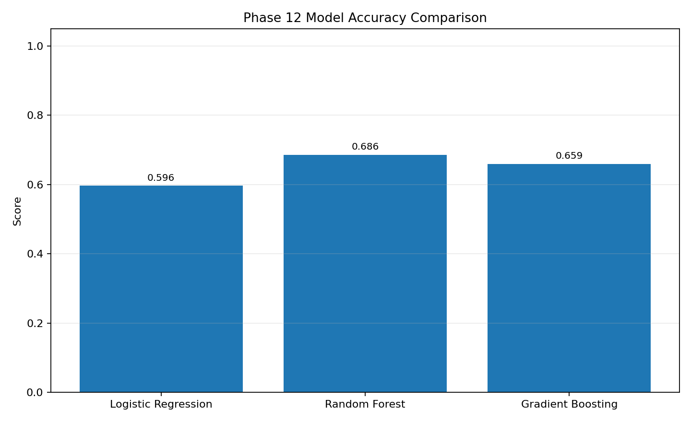

# Phase 12 - Accuracy Evaluation

## Model Results

| Model | Accuracy | Precision | Recall | F1 | ROC-AUC |
|---|---:|---:|---:|---:|---:|
| Logistic Regression | 0.5962 | 0.2179 | 0.6423 | 0.3254 | 0.6660 |
| Random Forest | 0.6858 | 0.2605 | 0.5832 | 0.3601 | 0.6958 |
| Gradient Boosting | 0.6592 | 0.2531 | 0.6394 | 0.3626 | 0.7038 |

## Accuracy Ranking

1. Random Forest: 0.6858
2. Gradient Boosting: 0.6592
3. Logistic Regression: 0.5962

Accuracy must be interpreted alongside recall and F1 because low CSAT is the minority class.

