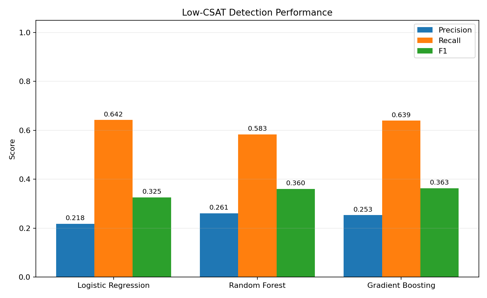

# Phase 12 - Precision, Recall, and F1 Evaluation

Low CSAT (`1`) is the positive class.

| Model | Accuracy | Precision | Recall | F1 | ROC-AUC |
|---|---:|---:|---:|---:|---:|
| Logistic Regression | 0.5962 | 0.2179 | 0.6423 | 0.3254 | 0.6660 |
| Random Forest | 0.6858 | 0.2605 | 0.5832 | 0.3601 | 0.6958 |
| Gradient Boosting | 0.6592 | 0.2531 | 0.6394 | 0.3626 | 0.7038 |

Recall measures how many low-CSAT cases are detected. Precision measures how many low-CSAT alerts are correct. F1 balances those two objectives. Threshold refinement in Phase 13 may improve the operational tradeoff.

