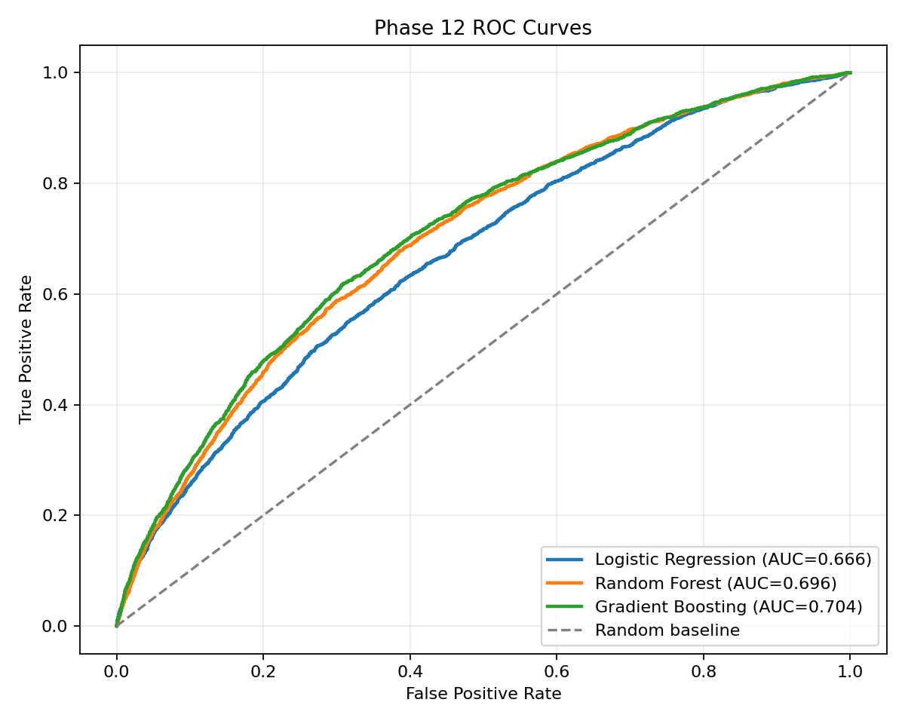

# Phase 12 - ROC-AUC Evaluation

| Model | Accuracy | Precision | Recall | F1 | ROC-AUC |
|---|---:|---:|---:|---:|---:|
| Logistic Regression | 0.5962 | 0.2179 | 0.6423 | 0.3254 | 0.6660 |
| Random Forest | 0.6858 | 0.2605 | 0.5832 | 0.3601 | 0.6958 |
| Gradient Boosting | 0.6592 | 0.2531 | 0.6394 | 0.3626 | 0.7038 |

ROC-AUC measures ranking ability across classification thresholds. The best observed ROC-AUC is 0.7038 from Gradient Boosting. A score above 0.50 indicates predictive signal beyond random ranking, but does not by itself establish deployment readiness.

