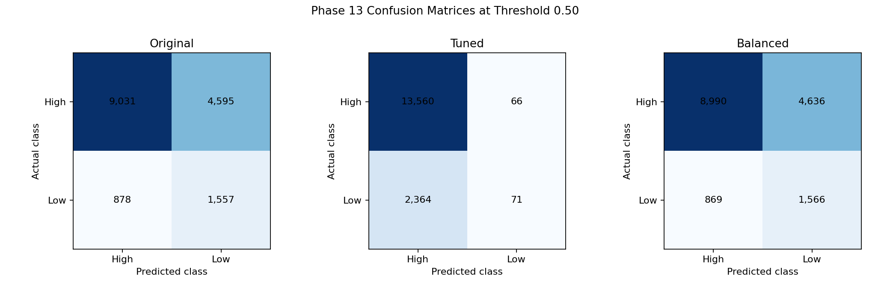

# Phase 13 - Confusion Matrix Analysis

Low CSAT (`1`) is the positive class. All matrices below use the unchanged Phase 12 test set and threshold 0.50.

| Model | TN | FP | FN | TP |
|---|---:|---:|---:|---:|
| Original Gradient Boosting | 9,031 | 4,595 | 878 | 1,557 |
| Tuned Gradient Boosting | 13,560 | 66 | 2,364 | 71 |
| Balanced Gradient Boosting | 8,990 | 4,636 | 869 | 1,566 |

The original balanced model detects 1,557 dissatisfied customers but produces 4,595 false alerts. False negatives (878) are missed dissatisfied customers and carry the greater customer-retention risk. False positives consume review or intervention capacity.

