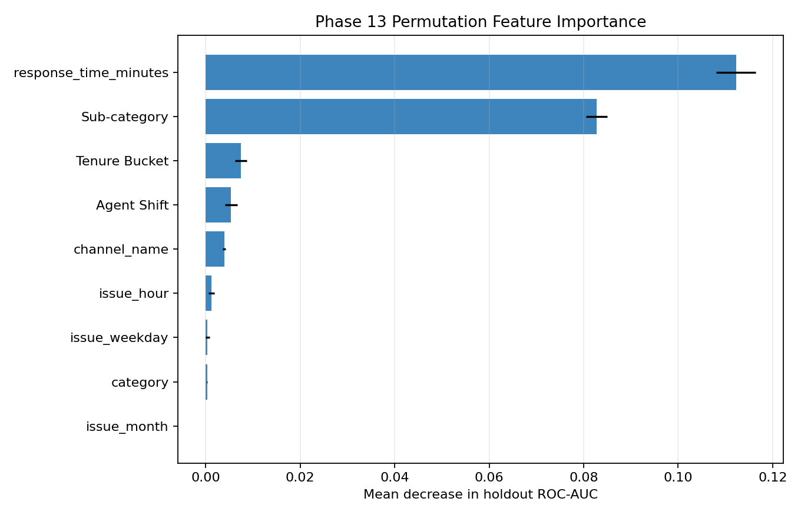

# Phase 13 - Feature Importance

Permutation importance was measured on the untouched test set using decrease in ROC-AUC. It evaluates each original feature as used by the full preprocessing and model pipeline.

| Rank | Feature | Mean ROC-AUC Decrease | Std. Dev. |
|---:|---|---:|---:|
| 1 | response_time_minutes | 0.11225 | 0.00413 |
| 2 | Sub-category | 0.08273 | 0.00227 |
| 3 | Tenure Bucket | 0.00746 | 0.00130 |
| 4 | Agent Shift | 0.00540 | 0.00134 |
| 5 | channel_name | 0.00395 | 0.00032 |
| 6 | issue_hour | 0.00117 | 0.00062 |
| 7 | issue_weekday | 0.00040 | 0.00041 |
| 8 | category | 0.00033 | 0.00008 |
| 9 | issue_month | 0.00000 | 0.00000 |

The top five predictive variables are response_time_minutes, Sub-category, Tenure Bucket, Agent Shift, channel_name. Importance indicates predictive contribution, not causal impact on satisfaction. Only nine approved Phase 12 predictors are available, so the chart presents all nine rather than padding the ranking to 20.

