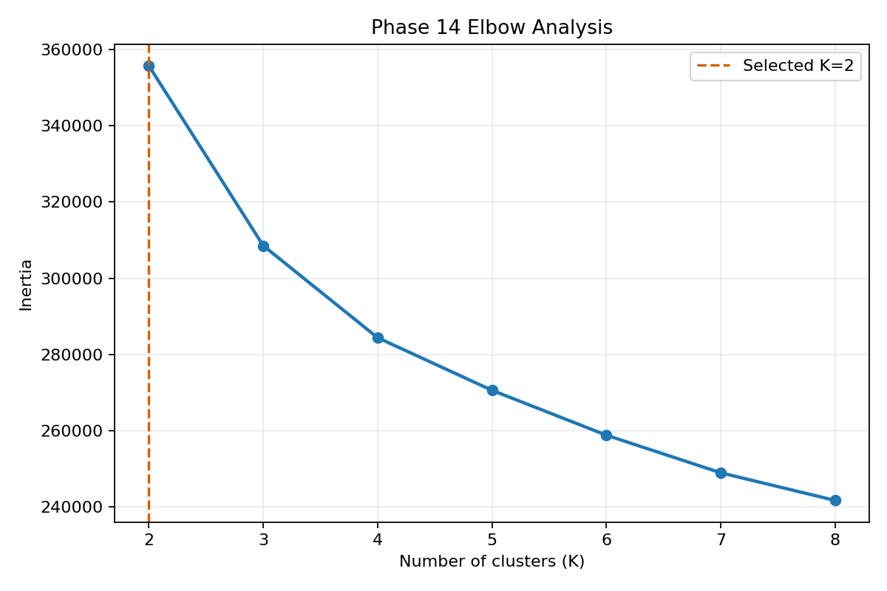
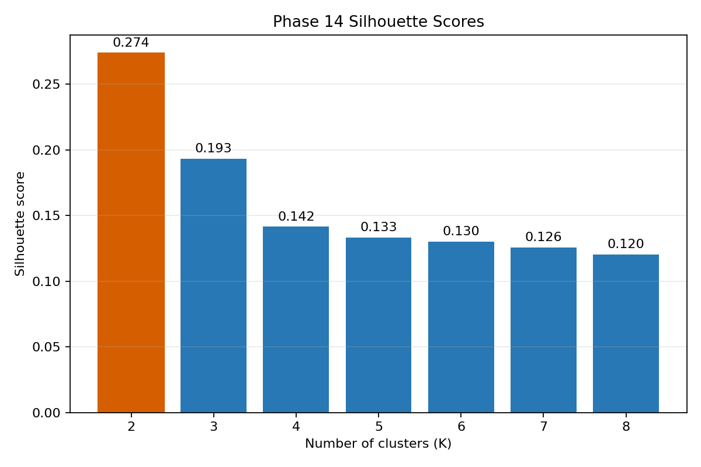

# Phase 14 - K Selection

K-Means was evaluated for K=2 through K=8 using `n_init=10` and `random_state=42`.

| K | Inertia | Silhouette |
|---|---|---|
| 2 | 355,679.76 | 0.2740 |
| 3 | 308,538.02 | 0.1933 |
| 4 | 284,412.56 | 0.1416 |
| 5 | 270,618.40 | 0.1334 |
| 6 | 258,856.95 | 0.1302 |
| 7 | 248,996.00 | 0.1257 |
| 8 | 241,749.91 | 0.1203 |

Silhouette scores use a fixed random sample of 10,000 rows. Inertia uses the complete clustering matrix.

**Recommended K: 2.**

The recommendation selects the highest sampled silhouette score, with the smaller K used as a tie-breaker. The elbow curve is retained as a secondary visual diagnostic.

