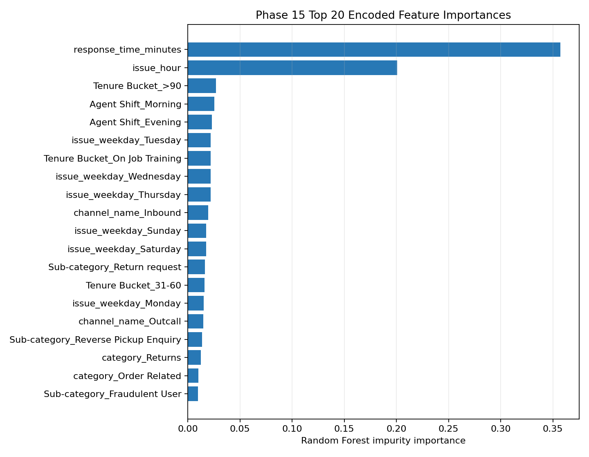

# Phase 15 - Feature Importance Ranking

## Top 20 Encoded Random Forest Features

| Rank | Feature | Importance |
|---:|---|---:|
| 1 | response_time_minutes | 0.35743 |
| 2 | issue_hour | 0.20086 |
| 3 | Tenure Bucket_>90 | 0.02714 |
| 4 | Agent Shift_Morning | 0.02545 |
| 5 | Agent Shift_Evening | 0.02309 |
| 6 | issue_weekday_Tuesday | 0.02206 |
| 7 | Tenure Bucket_On Job Training | 0.02204 |
| 8 | issue_weekday_Wednesday | 0.02189 |
| 9 | issue_weekday_Thursday | 0.02184 |
| 10 | channel_name_Inbound | 0.01945 |
| 11 | issue_weekday_Sunday | 0.01765 |
| 12 | issue_weekday_Saturday | 0.01757 |
| 13 | Sub-category_Return request | 0.01656 |
| 14 | Tenure Bucket_31-60 | 0.01591 |
| 15 | issue_weekday_Monday | 0.01520 |
| 16 | channel_name_Outcall | 0.01475 |
| 17 | Sub-category_Reverse Pickup Enquiry | 0.01376 |
| 18 | category_Returns | 0.01235 |
| 19 | category_Order Related | 0.00998 |
| 20 | Sub-category_Fraudulent User | 0.00964 |

## Grouped Operational-Variable Importance

| Rank | Feature | Importance |
|---:|---|---:|
| 1 | response_time_minutes | 0.10195 |
| 2 | Sub-category | 0.03631 |
| 3 | Tenure Bucket | 0.00623 |
| 4 | issue_weekday | 0.00265 |
| 5 | channel_name | 0.00199 |
| 6 | Agent Shift | 0.00193 |
| 7 | issue_hour | 0.00140 |
| 8 | issue_month | 0.00015 |
| 9 | category | 0.00004 |

Grouped values are holdout permutation importance measured as decrease in R-squared. Negative or near-zero values indicate no reliable incremental holdout contribution in this fitted model.

