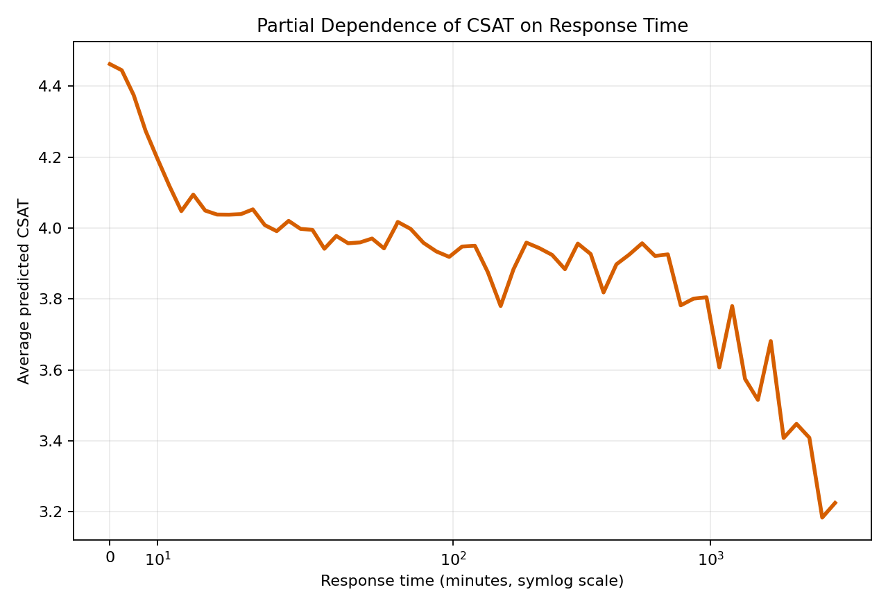

# Phase 15 - Partial Dependence Analysis

The response-time curve varies response time across a fixed 5,000-row holdout sample while retaining each record's other operational features. Predictions are averaged using the Random Forest model.

| Response Time | Average Predicted CSAT | Change from Immediate Response |
|---:|---:|---:|
| 0 minutes | 4.462 | +0.000 |
| 5 minutes | 4.375 | -0.087 |
| 15 minutes | 4.048 | -0.415 |
| 30 minutes | 4.053 | -0.410 |
| 60 minutes | 4.006 | -0.456 |
| 240 minutes | 3.939 | -0.523 |
| 1,440 minutes | 3.659 | -0.803 |

The relationship is nonlinear: the largest deterioration occurs as response moves from immediate handling into longer delays, with additional decline at extended response times. The curve is model-based sensitivity analysis, not a causal estimate.

