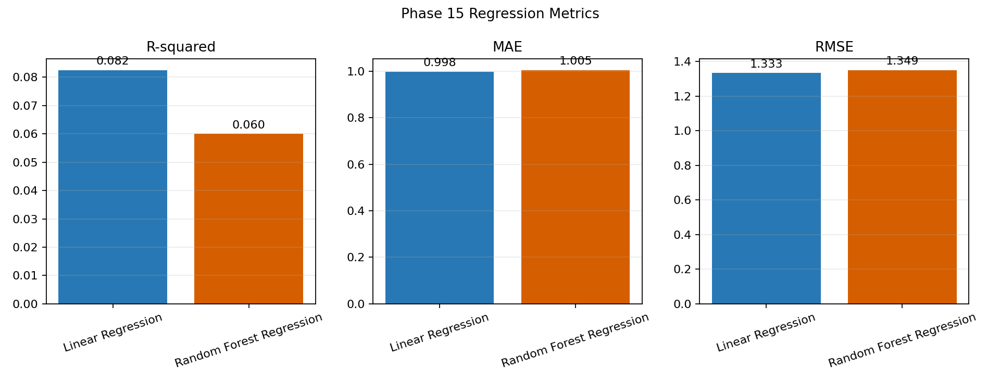

# Phase 15 - Regression Metrics

| Model | R-squared | MAE | RMSE |
|---|---:|---:|---:|
| Linear Regression | 0.0825 | 0.9981 | 1.3329 |
| Random Forest Regression | 0.0600 | 1.0048 | 1.3491 |

Higher R-squared and lower MAE/RMSE indicate better holdout performance. The stronger model is **Linear Regression** by R-squared.

