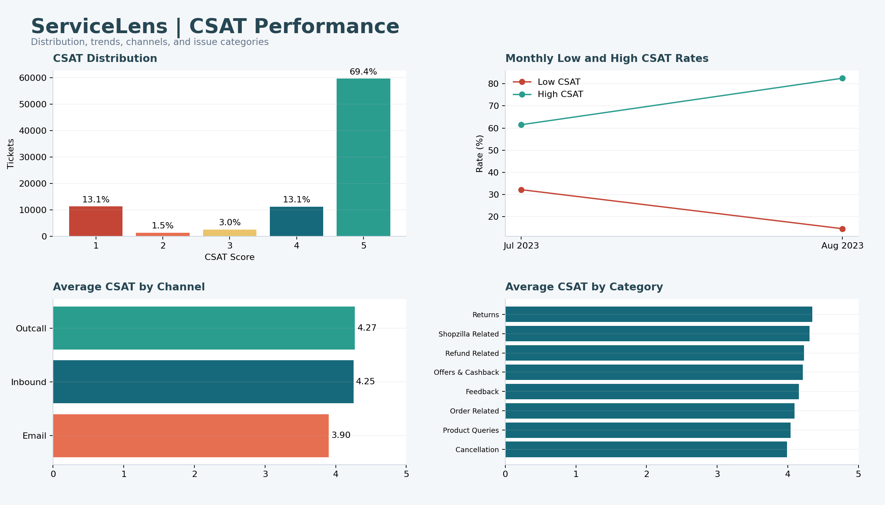

# Phase 16 - CSAT Performance Dashboard

## Design

CSAT distribution, monthly low/high rates, channel comparison, and established category comparison. Verified headline values are mean CSAT 4.242, low CSAT 14.57%, and high CSAT 82.46%.

## Tableau Build Notes

- Use a fixed desktop layout near 1,400 x 800 pixels.
- Apply dashboard filter actions rather than duplicating controls per worksheet.
- Format CSAT to two or three decimals and rates as percentages.
- Preserve the response-time validity filter.
- Add source and refresh date in the dashboard footer.

## Preview

The image below is a reproducible design preview generated from the verified data. It is not represented as a native Tableau export.

