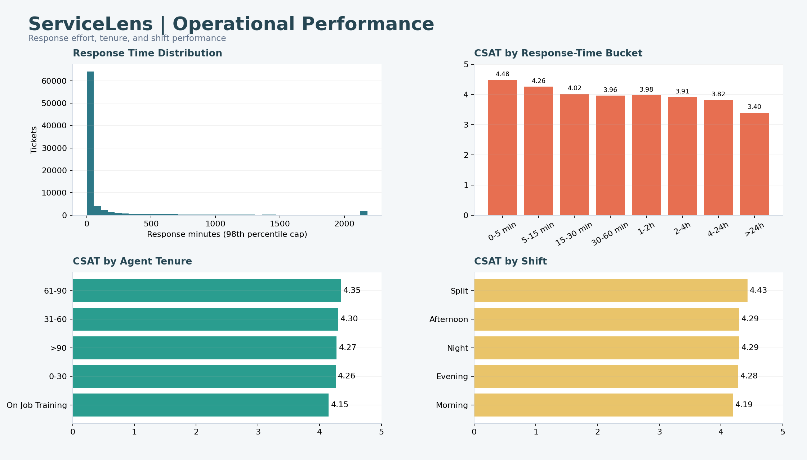

# Phase 16 - Operational Performance Dashboard

## Design

Response-time distribution and buckets, tenure performance, and shift performance. Response time is the strongest measured driver; On Job Training and Morning are the weakest observed tenure and shift groups.

## Tableau Build Notes

- Use a fixed desktop layout near 1,400 x 800 pixels.
- Apply dashboard filter actions rather than duplicating controls per worksheet.
- Format CSAT to two or three decimals and rates as percentages.
- Preserve the response-time validity filter.
- Add source and refresh date in the dashboard footer.

## Preview

The image below is a reproducible design preview generated from the verified data. It is not represented as a native Tableau export.

