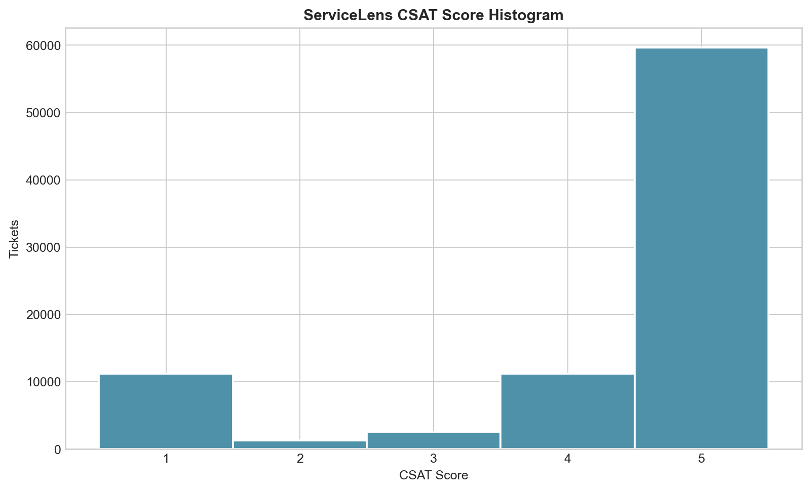
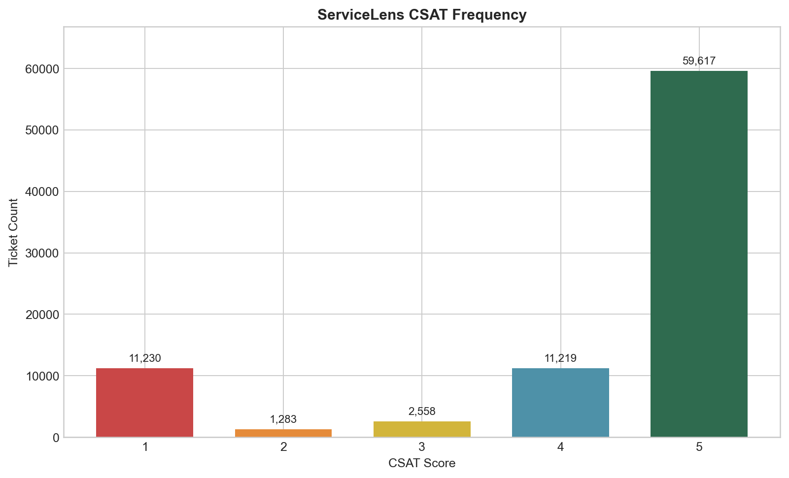
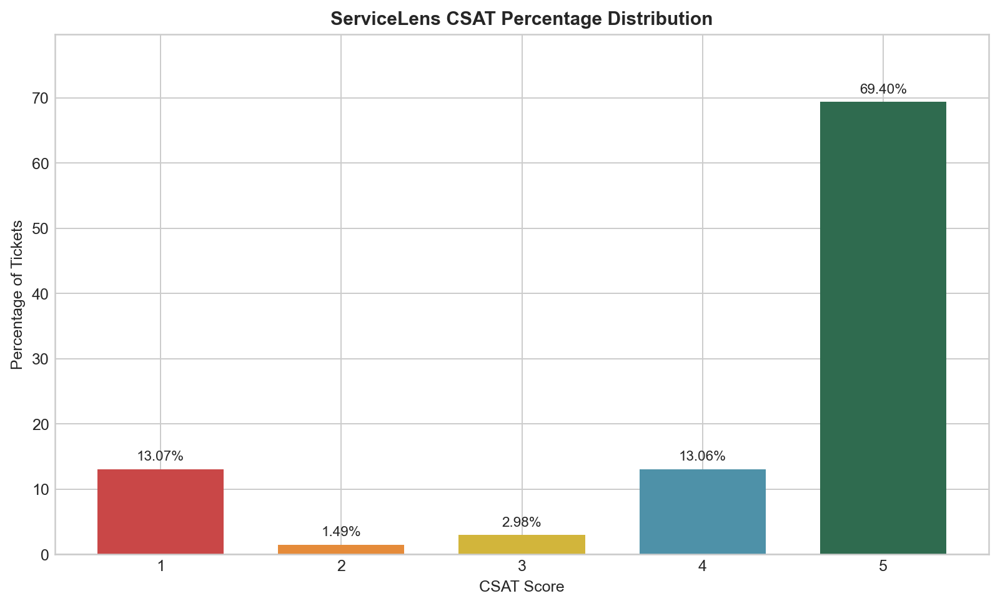

# Phase 8 - CSAT Visualization

Three figures visualize the verified target distribution.

## Histogram

The discrete histogram shows concentration at score 5 and the smaller lower-score groups.

## Frequency Bar Chart

The frequency chart labels the exact count for each score.

## Percentage Distribution

The percentage chart shows score 5 at 69.40%, with scores 1 and 4 each near 13%.

No predictive analysis was performed.
